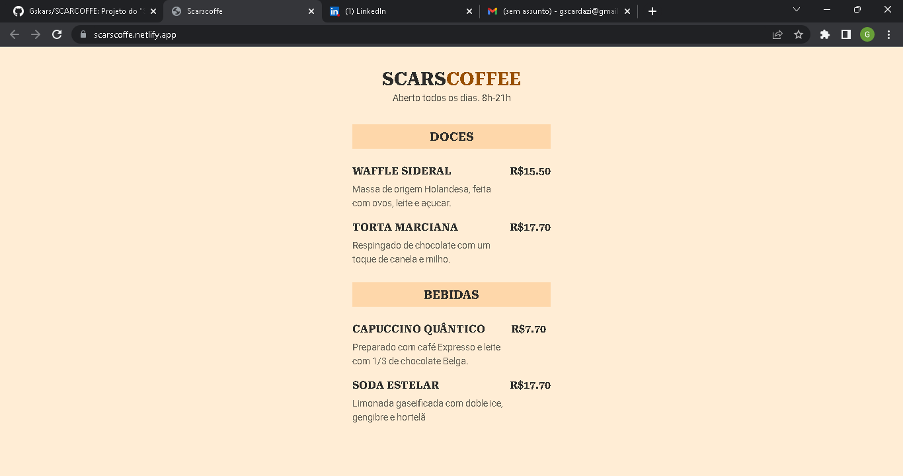

# SCARCOFFE

<h3>Um cardápio de um café Estelar... Projeto desenvolvido na semana Explorer,cujo objetivo foi a criação de um cardápio digital.</h3>

<h2>HOSPEDAGEM DO SITE:</h2>   https://lnkd.in/dvRqE5yH

# Tecnologias :
- HTML
- CSS
- GIT E GITHUB
# Contatos:
- Email: guiScarcazi.dev@outlook.com
- Linkedin: https://www.linkedin.com/in/guilherme-scardazi-67875a1b8/
